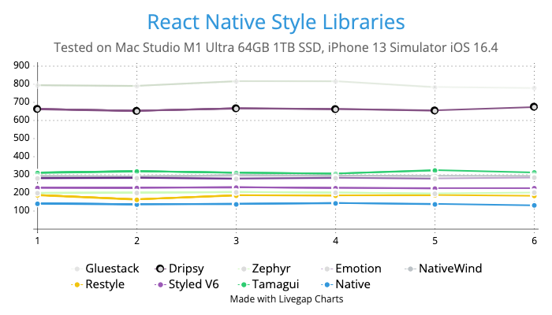
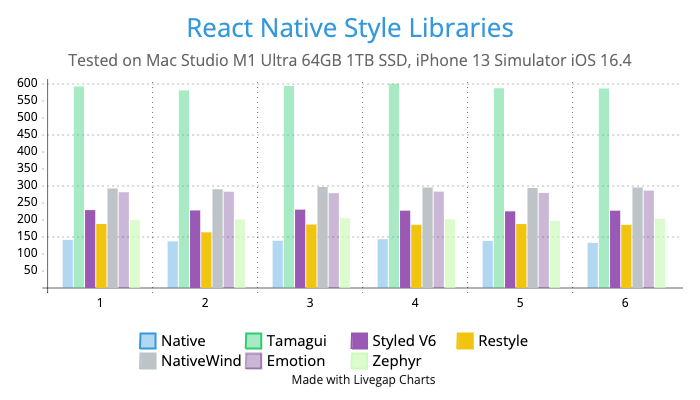

# React Native Style Libraries Benchmark

Original reproducer was created by @tj-mc: https://github.com/tj-mc/styled-components-native-perf-reproducer

This is an Expo SDK 49 App reproducer to demonstrate the performance difference between popular style libraries and react-native built-in styling.

Tests include React Native [StyleSheet](https://reactnative.dev/docs/stylesheet), [Styled Components](https://github.com/styled-components/styled-components), [Tamagui](https://github.com/tamagui/tamagui), [NativeWind](https://github.com/marklawlor/nativewind), [Emotion](https://github.com/emotion-js/emotion), [Zephyr](https://github.com/FormidableLabs/react-native-zephyr), [Dripsy](https://github.com/nandorojo/dripsy), Gluestack [1](https://github.com/gluestack/gluestack-ui) [2](https://github.com/gluestack/gluestack-style), [fast-styles](https://github.com/fedemartinm/fast-styles), [Tailwind React Native Classnames(twrnc)](https://github.com/jaredh159/tailwind-react-native-classnames) and Shopify [restyle](https://github.com/Shopify/restyle)

Feel free to fork or PR this repo with improvements or to include other styling libraries.

### ***Note: Test scores may vary between different machines with different hardware***

~~Note: `Tamagui` scores are surprisingly low, I've created a [discussion about it](https://github.com/tamagui/tamagui/discussions/1471)~~
 
#### Note: Tamagui compiler is turned off in DEV mode, production/release performance is greatly improved, it reaches `StyleSheet` levels.

1000 items are rendered in `Array.map` and it's a **basic** test in DEV mode. When more features of each library are added (eg. media queries etc) as your project grows the measurements may vary by a lot.

Read this comment on how to test the performance: https://github.com/styled-components/styled-components/issues/3940#issuecomment-1630244738

Demo video with `TAMAGUI_TARGET=native expo start --no-dev --minify`:

https://github.com/efstathiosntonas/react-native-style-libraries-benchmark/assets/717975/9942825e-2e97-47ac-9311-0df98718b3b1

## Results - Rendering Time for 1000 Empty Views (ms) in DEV mode

Mac Specs: 
Mac Studio M1 Ultra 1TB SSD 64GB RAM\
Simulator: iPhone 13, iOS 16.4

\

|             | 1     | 2     | 3     | 4     | 5     | 6     | Avg    | % Slowdown |
|-------------|-------|-------|-------|-------|-------|-------|--------|------------|
| Native      | 140.1 | 135.6 | 137.5 | 142.1 | 137.2 | 131.3 | 137.6  | 0          |
| twrnc       | 159   | 161   | 162   | 158   | 156   | 161   | 159.5  | 15.92%     |
| fast-styles | 162   | 163   | 166   | 164   | 162   | 168   | 164.17 | 19.30%     |
| Restyle     | 186.8 | 162.3 | 185.2 | 184.4 | 186.6 | 184.2 | 182.5  | 32.63%     |
| Zephyr      | 198.4 | 200.2 | 203.6 | 200.7 | 195.8 | 202.5 | 200.2  | 45.47%     |
| Styled v6   | 227.7 | 226.7 | 229   | 226   | 224   | 225.9 | 226.7  | 64.86%     |
| Emotion     | 280.1 | 281.7 | 277.5 | 282   | 278.2 | 285   | 280.9  | 104.8%     |
| NativeWind  | 291.3 | 289   | 295.6 | 293.9 | 292.6 | 294   | 292.9  | 112.3%     |
| Tamagui     | 310   | 318   | 310   | 305   | 324   | 313   | 314.33 | 128.57%    |
| Dripsy      | 661.5 | 651.3 | 665.1 | 661.4 | 653.6 | 673.7 | 661.1  | 380.53%    |
| Gluestack   | 793   | 789   | 815   | 815   | 783   | 779   | 798.83 | 480.24%    |

### scores with `TAMAGUI_TARGET=native expo start --no-dev --minify`:
(after every run metro is shut down, always start fresh)

|             | 1   | 2   | 3   | 4   | 5   | 6   | Avg    | % Slowdown |
|-------------|-----|-----|-----|-----|-----|-----|--------|------------|
| Native      | 57  | 56  | 54  | 53  | 53  | 53  | 54.33  | 0          |
| fast-styles | 68  | 66  | 66  | 64  | 66  | 66  | 66.33  | 21.98%     |
| twrnc       | 68  | 69  | 68  | 68  | 68  | 68  | 68     | 24.93%     |
| Zephyr      | 75  | 77  | 76  | 77  | 75  | 76  | 76     | 39.29%     |
| Restyle     | 81  | 80  | 81  | 82  | 80  | 85  | 81.5   | 49.92%     |
| Styled v6   | 101 | 101 | 98  | 98  | 100 | 99  | 99.83  | 83.27%     |
| Emotion     | 135 | 132 | 130 | 128 | 128 | 129 | 130.33 | 139.69%    |
| NativeWind  | 138 | 139 | 139 | 134 | 137 | 137 | 137.33 | 152.17%    |
| Tamagui     | 173 | 174 | 172 | 172 | 176 | 174 | 173.5  | 219.84%    |
| Dripsy      | 559 | 557 | 554 | 559 | 561 | 558 | 557.96 | 926.47%    |
| Gluestack   | 663 | 654 | 661 | 664 | 660 | 660 | 660.33 | 1112.38%   |

# Reproduction Steps
1. Start the profiler by pressing Shift + M and open React Dev Tools.
2. Open profiler and hit record
3. Press the toggle button and stop recording
4. Record the time to render App.ts
5. Average the result across at least 3 runs

