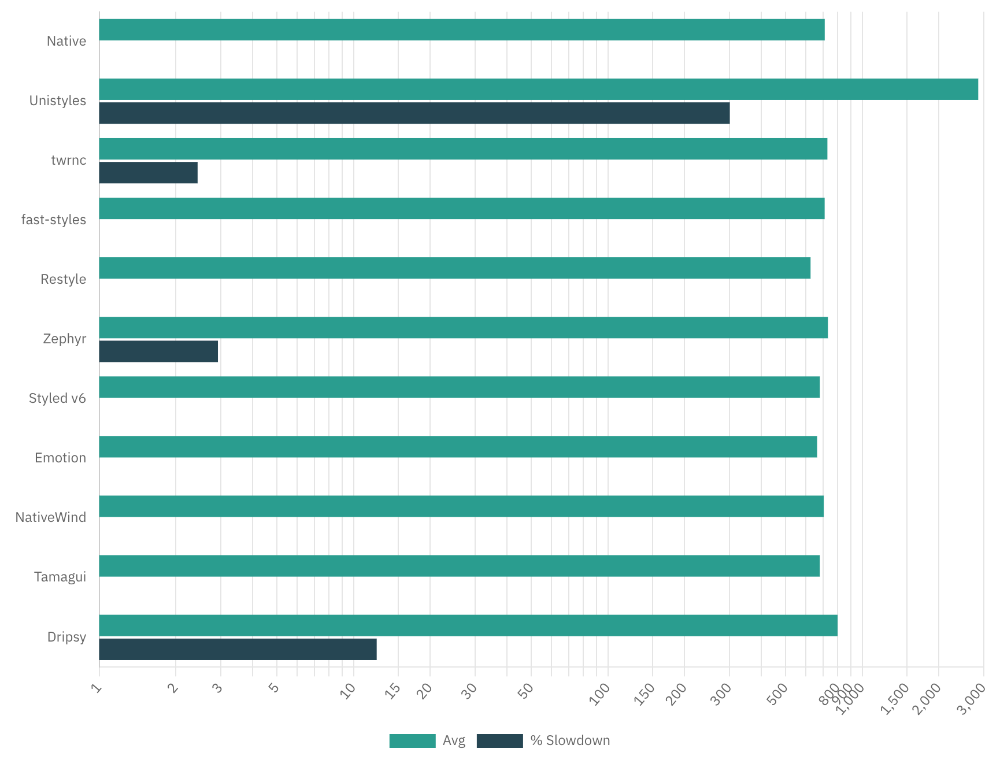

# React Native Style Libraries Benchmark

Original reproducer was created by @tj-mc: https://github.com/tj-mc/styled-components-native-perf-reproducer

This is an Expo App reproducer to demonstrate the performance difference between using popular style libraries and react-native built-in styling.

Tests include React Native `StyleSheet`, Styled Components v6, Tamagui, NativeWind and Shopify Restyle

### ***Note: Test scores may vary between different machines with different hardware***

1000 items are rendered in `Array.map` to simulate the complexity of a real app.

Read this comment on how to test the performance: https://github.com/styled-components/styled-components/issues/3940#issuecomment-1630244738

## Results - Styled v Native Render Time 1000 Empty Views (ms)

|           | 1   | 2   | 3   | 4   | 5   | 6   | Avg | % Slowdown |
|-----------|-----|-----|-----|-----|-----|-----|-----|------------|
| Native    | 289 | 281 | 286 | 296 | 280 | 268 |  283 | 0          |
| Styled v5 | 440 | 426 | 424 | 428 | 429 | 432 |  429 | 41.0       |
| Styled v6 | 400 | 404 | 401 | 395 | 404 | 400 | 400 | 34.2       |

# Reproduction Steps
1. Start the profiler by pressing Shift + M and open React Dev Tools.
2. Open profiler and hit record
3. Press the toggle button and stop recording
4. Record the time to render App.ts
5. Average the result across at least 3 runs

